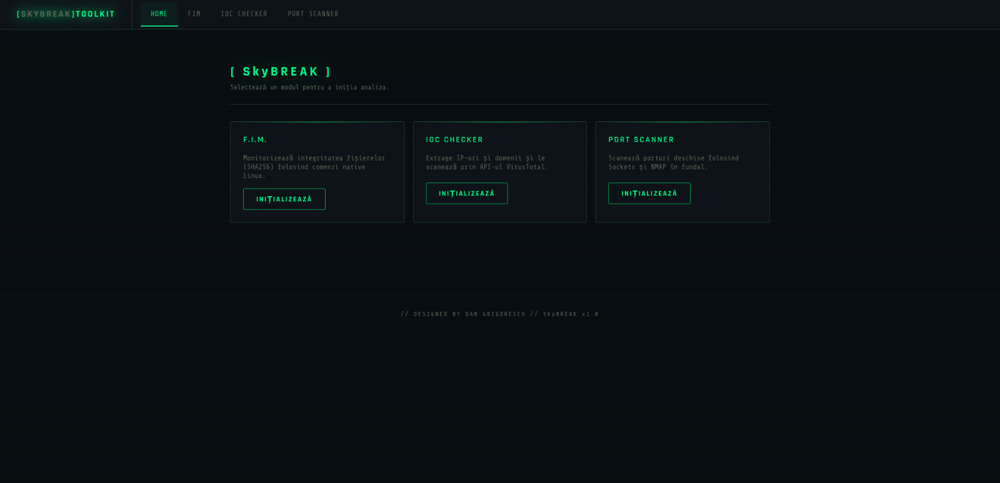
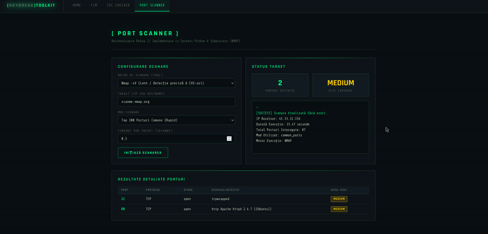
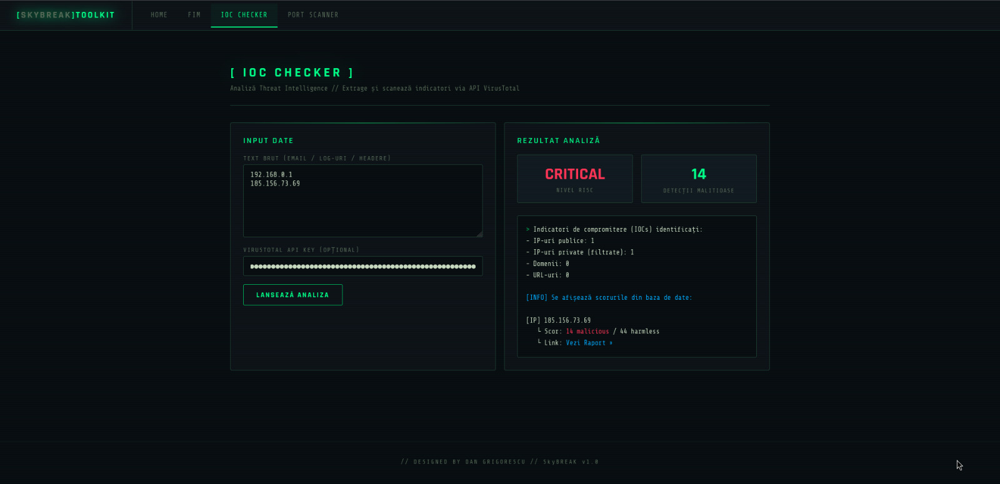
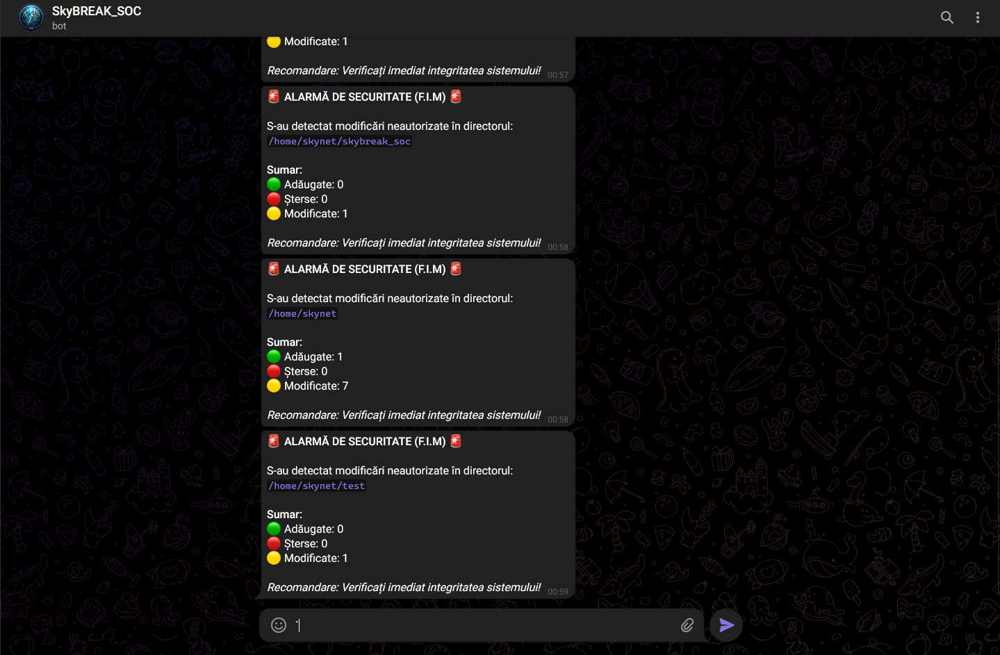

## **SkyBREAK_SOC – Security Operations Center & System Monitor**

### 1. PREREQUISITES & RUN (Cerințe de sistem și Configurare)

Aplicația **SkyBREAK_SOC** este o platformă hibridă de monitorizare și securitate ce combină scripturi Python 3 cu apeluri de sistem și utilitare native din linia de comandă Linux (CLI).

#### **Dependențe de sistem (Sistem de operare recomandat: Linux / Ubuntu / Debian)**

Pentru a rula întreaga suită de funcționalități (în special interogările CLI native), sistemul gazdă trebuie să aibă instalate următoarele pachete de sistem:

* **Python 3** (și managerul de pachete `pip`)
* **python3-venv** (pentru izolarea bibliotecilor)
* **nmap** (utilizat de modulul de rețea pentru scanare avansată și amprentarea serviciilor)

Instalarea acestora pe un sistem bazat de Debian/Ubuntu se face prin comanda:

```bash
sudo apt-get update && sudo apt-get install -y python3 python3-venv python3-pip nmap

```

#### **Dependențe Python (Module necesare)**

Proiectul utilizează librării externe pentru infrastructura web și apelurile HTTP asincrone:

* `Flask` (pentru arhitectura serverului web și rutarea API-ului REST)
* `requests` (pentru comunicarea cu API-urile externe: VirusTotal, NIST NVD și Telegram Bot API)

---

### 2. GHID DE RULARE (Prin ce fișier pornesc rularea?)

Proiectul conține un script de automatizare numit `setup.sh` care configurează automat mediul virtual, instalează pachetele Python și pornește aplicația.

#### **Varianta A: Rularea automată (Recomandat pe Linux)**

1. Se deschide terminalul în directorul rădăcină al proiectului.
2. Se acordă drepturi de execuție scriptului de setup:
```bash
chmod +x setup.sh

```


3. Se rulează scriptul:
```bash
./setup.sh

```


#### **Varianta B: Rularea manuală pas cu pas**

Dacă se dorește configurarea manuală sau rularea pe un alt mediu, pașii sunt următorii:

1. Crearea și activarea unui mediu virtual Python:
```bash
python3 -m venv venv
source venv/bin/activate

```


2. Instalarea modulelor necesare:
```bash
pip install flask requests

```


3. **Lansarea în execuție a fișierului principal:**
```bash
python3 app.py

```


După pornire, serverul Flask va rula nativ pe portul `5000`. Aplicația poate fi accesată din orice browser la adresa: **`http://127.0.0.1:5000`** sau **`http://localhost:5000`**.

---

### 3. EXPLICATIE TEHNICĂ (Ce anume s-a realizat?)

Proiectul a fost dezvoltat de la zero, având ca punct de pornire conceptele teoretice discutate la curs și laboratoare (manipularea proceselor, expresii regulate, utilizarea modulului `subprocess` și programarea de rețea prin Sockets). Arhitectura este complet modulară, fiind împărțită într-un nucleu de backend (Python 3 / Flask API) și o interfață modernă, complet asincronă (HTML5 / CSS3 / JavaScript Fetch API).

#### **Modulele Dezvoltate și Logica de Funcționare:**

1. **F.I.M. (File Integrity Monitor):**
* **Interacțiune Linux CLI & Syscalls:** Modulul apelează comanda nativă `find` din Linux prin `subprocess.run` pentru a genera o listă recursivă a tuturor fișierelor dintr-un director țintă. Pentru fiecare fișier identificat, apelează utilitarul de sistem `sha256sum` pentru a calcula o amprentă digitală unică. De asemenea, folosește apelul de sistem `os.stat` pentru a extrage metadate critice: dimensiunea în bytes, permisiunile fișierului (în format octal) și timestamp-ul ultimei modificări.
* **Mecanism de Redundanță (Fault Tolerance):** Dacă utilitarul CLI `sha256sum` lipsește din sistem sau returnează o eroare, codul face automat fallback pe o implementare internă pură de Python folosind biblioteca `hashlib`.
* **Logică de Securitate & Alertare:** În faza de verificare, se compară starea curentă a fișierelor cu un baseline stocat într-un fișier securizat JSON. Folosind operații pe seturi (`set()`), se determină instantaneu fișierele adăugate, șterse sau modificate. În cazul identificării unei modificări neautorizate, modulul interoghează asincron **Telegram Bot API**, trimițând o alertă critică de securitate în timp real pe canalul administratorului. De asemenea, oferă posibilitatea exportării automate a unui raport detaliat în format `.csv`.


2. **Port Scanner cu CVE Vulnerability Mapping:**
* **Logica de Rețea:** Realizează un *TCP Connect Scan* nativ. Modulul instanțiază obiecte de tip `socket.socket` și folosește funcția `connect_ex((host, port))` pentru a încerca realizarea unui TCP 3-way handshake. Returnarea codului `0` indică o poartă deschisă.
* **Optimizare prin Multithreading:** Pentru a evita blocajele generate de timeout-uri rețelei, scanarea nu se face secvențial. S-a implementat paralelism folosind un pool de fire de execuție (`concurrent.futures.ThreadPoolExecutor`), permițând scanarea simultană a sute de porturi în mai puțin de o secundă.
* **Integrare Nmap & Extensie Threat Intel (CVE Lookup):** Dacă sistemul dispune de utilitarul `nmap`, aplicația îl poate apela direct în fundal pentru a efectua o scanare avansată de versiuni (`nmap -sV`). Serviciile descoperite sunt trimise automat într-o funcție de lookup care interoghează în timp real API-ul oficial al Guvernului American (**NIST NVD - National Vulnerability Database**), extrăgând automat codurile CVE și scorurile de severitate CVSS asociate acelor servicii.


3. **IOC Checker (Indicatori de Compromitere):**
* **Parsare & Logică Avansată:** Modulul primește un text brut (corpul unui e-mail suspect, headere sau log-uri de sistem) și utilizează expresii regulate complexe (`re.compile`) pentru a identifica și extrage adrese IPv4, URL-uri și domenii.
* **Filtrare Inteligentă:** Implementează o funcție dedicată de analiză a claselor de rețea (`_is_private_ip`) pentru a detecta și filtra adresele IP private sau de loopback (ex: `127.0.0.1`, `192.168.x.x`, `10.x.x.x`), împiedicând trimiterea de date locale inutile către internet.
* **Threat Intelligence Integration:** Indicatorii publici extrași sunt transmiși controlat către **API-ul VirusTotal v3** (folosind encodare Base64 securizată pentru URL-uri). Răspunsul JSON pachetează date despre reputația globală a indicatorului, numărul de motoare antivirus care l-au flagat ca malițios, țara de origine și compania de hosting (AS Owner). Pe baza acestor date, backend-ul calculează algoritmic un scor global de risc (LOW, MEDIUM, HIGH, CRITICAL).

* *Amprenta de Securitate:* -> Clasa `EmailChecker` introduce un header HTTP custom în request-urile transmise rețelei globale: `{'X-Developed-By': 'Dan Grigorescu - ETTI'}` ca dovadă incontestabilă a paternității codului în timpul tranzitului de date.

---

### 4. SCREENSHOT-URI DIN TIMPUL RULĂRII

**1. Dashboard-ul Principal (Skybreak_SOC):**
Platforma centrală de monitorizare.


**2. Modulul Port Scanner:**
Scanare hibridă (Nmap + NIST NVD) cu detecție de versiuni și mapare CVE.


**3. Modulul F.I.M. (File Integrity Monitor):**
Detecția modificărilor neautorizate și generarea alertei.


**4. Modulul IOC Checker:**
Extragerea indicatorilor din log-uri și analiza reputației via VirusTotal.


**5. Alerta Telegram:**
Alerta telegram generata de modulul F.I.M.

---

### 5. REFERINȚE BIBLIOGRAFICE & RESURSE UTILIZATE

1. **Documentația Oficială Flask (Routing & Templates):** [https://flask.palletsprojects.com/](https://flask.palletsprojects.com/)
2. **Documentația Python 3 (Modulele `socket`, `subprocess`, `concurrent.futures`):** [https://docs.python.org/3/](https://docs.python.org/3/)
3. **Ghidul de integrare VirusTotal API v3:** [https://docs.virustotal.com/reference/overview](https://docs.virustotal.com/reference/overview)
4. **Manualul de utilizare al API-ului NIST NVD (Căutare vulnerabilități):** [https://services.nvd.nist.gov/rest/json/cves/2.0](https://www.google.com/search?q=https://services.nvd.nist.gov/rest/json/cves/2.0)
5. **Telegram Bot API (sendMessage documentation):** [https://core.telegram.org/bots/api#sendmessage](https://www.google.com/search?q=https://core.telegram.org/bots/api%23sendmessage)
6. **Ghiduri RegExp (W3Schools & Regex101):** [https://www.w3schools.com/python/python_regex.asp](https://www.w3schools.com/python/python_regex.asp)

#### **Link-uri obligatorii pentru transparență și controlul codului:**

* **Link share-uibil LLM (Claude AI):** [https://claude.ai/share/81697c9b-0cea-4176-b188-d6cca79dd5ae](https://claude.ai/share/81697c9b-0cea-4176-b188-d6cca79dd5ae)
* **URL GitHub Proiect:** *[(https://github.com/danydanyqwer/Cybersecurity-Toolkit)](https://github.com/danydanyqwer/Cybersecurity-Toolkit)*
